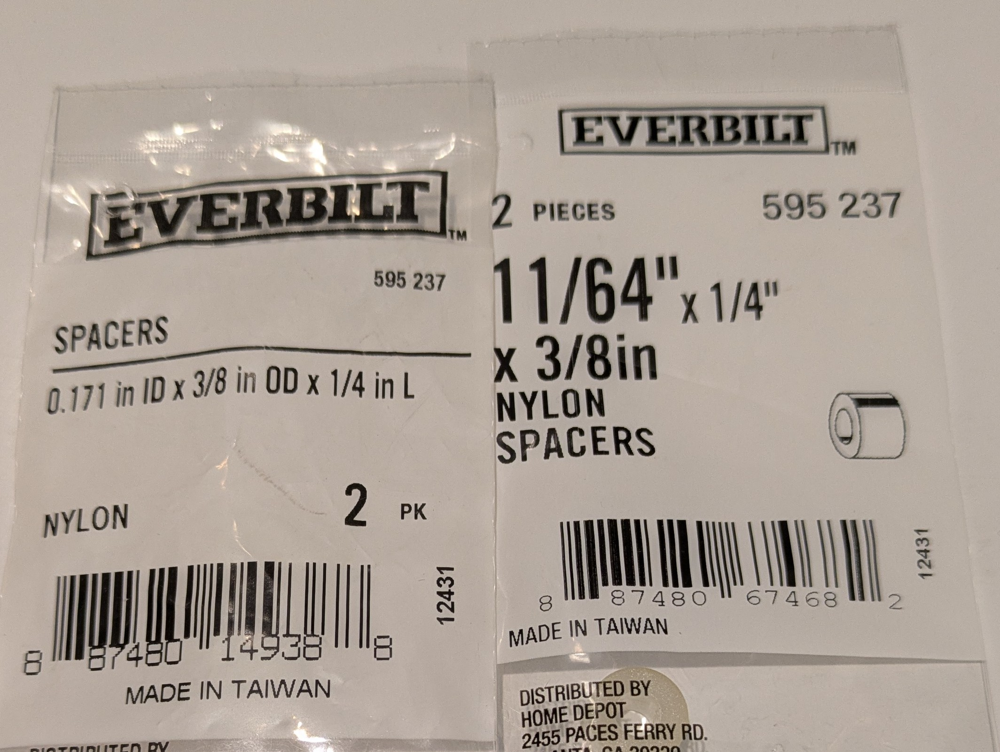
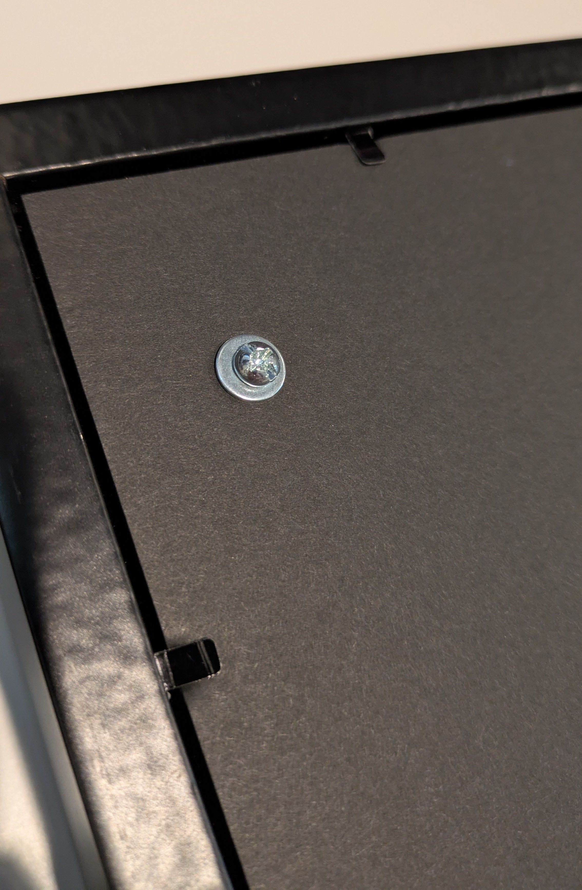
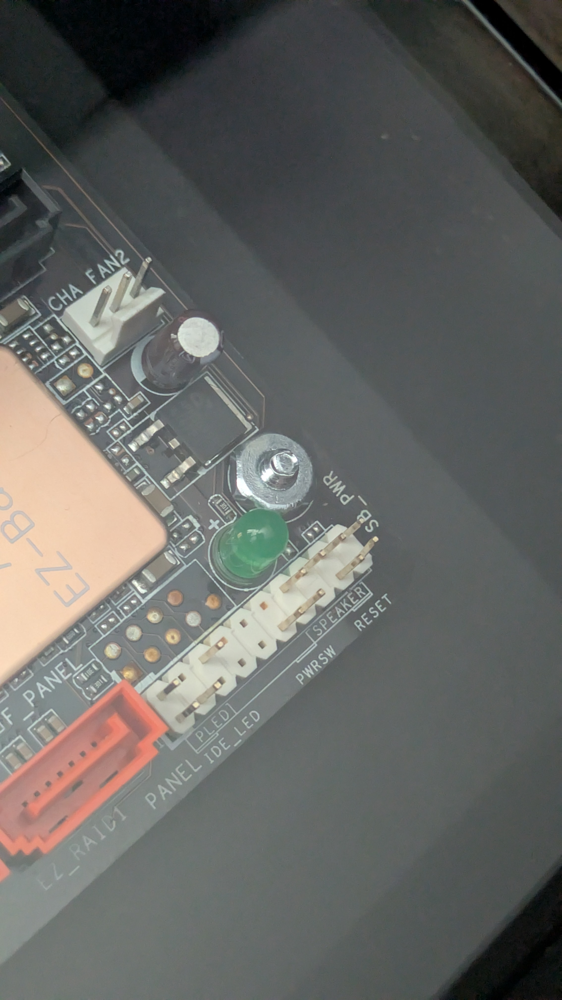
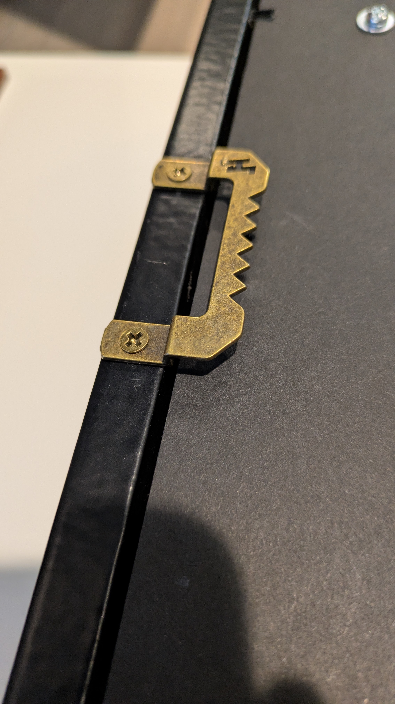
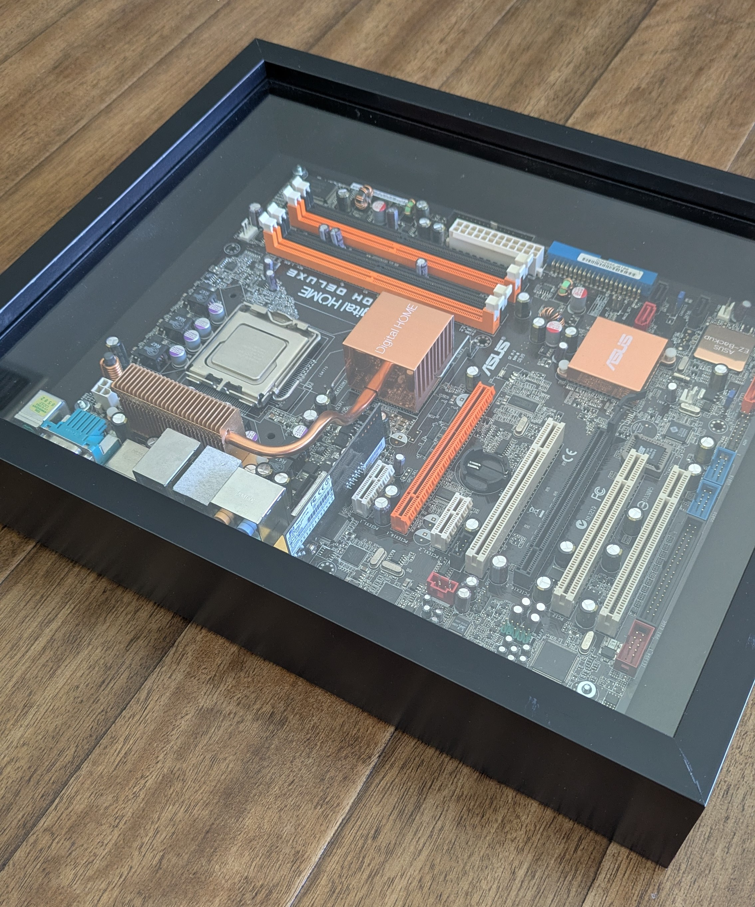
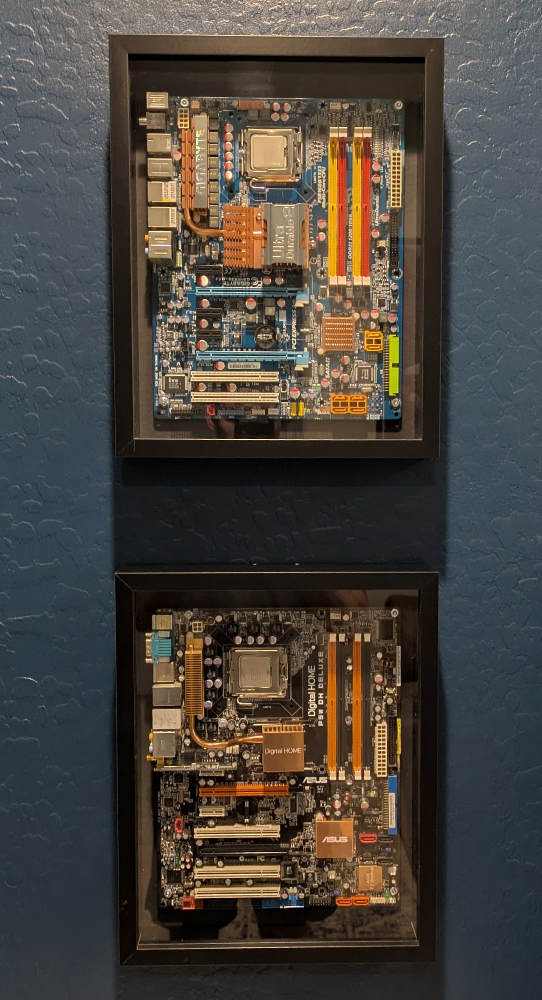

# Motherboard Display

How-To on displaying old motherboards.

Information on all the needed items to hang a standard ATX (12" x 9.6") motherboard on the wall.

## Supplies

* Hobby Lobby
  * [Extra Thick Foam Board 1/2" x 20" x 30"](https://www.hobbylobby.com/art-supplies/project-supplies/poster-projects/black---extra-thick-foam-board---20-x-30/p/80645203) (Qt 1) - $5.99
  * [Deep Wood Shadow Box 11" x 14" (3" Deep)](https://www.hobbylobby.com/home-decor-frames/frames-framing-supplies/shadow-boxes-display-cases/black---deep-wood-shadow-box---11-x-14/p/80997748) (Qt 1) - $14.99
  * Hobby Lobby associate to cut the foam board there
  * (Optional) [Easy Hooks (60lbs)](https://www.hobbylobby.com/home-decor-frames/frames-framing-supplies/hardware-accessories/easy-hooks/p/81032934) (Qt 1) - $2.79
* Home Depot
  * [Everbilt 0.171" x 3/8" x 1/4" Nylon Spacers (2-Pack)](https://www.homedepot.com/p/Everbilt-1-in-x-3-8-in-O-D-x-0-171-in-I-D-Nylon-Spacer-2-Pack-814958/204225906) (Qt 2) - $2.97
    * **NOTE:** The link is for 1" as the 1/4" isn't listed on their website, but it is in store
  * [Everbilt #6-32 1" Round Head Combo Zinc](https://www.homedepot.com/p/Everbilt-6-32-x-1-in-Zinc-Plated-Combo-Round-Head-Machine-Screw-8-Pack-831441/317479033) (Qt 1) - $1.56
  * [Everbilt #6 Zinc Flat Washer (30-Pack)](https://www.homedepot.com/p/Everbilt-6-Zinc-Flat-Washer-30-Pack-828771/317537961) (Qt 1) - $1.57
  * (Optional) [20 lbs. Canvas Sawtooth Hanger (3-Pack)](https://www.homedepot.com/p/HangZ-20-lbs-Canvas-Sawtooth-Hanger-3-Pack-20000/206471207) (Qt 1) - $8.98
* Total: ~$38.85 (without optional items: ~$27.08)

### Optional Items

The two items that are optional are if you want to hang it a different way. I just found using the Sawtooth Hanger with the Easy Hooks was just the simplest and most secure.

## Hobby Lobby Trip

> **NOTE:** The *Extra Thick Foam Board* will give you enough area for 2 *Deep Wood Shadow Box* displays.

The reason for the *Extra Thick Foam Board* is to replace the felt backing of the *Deep Wood Shadow Box* to remove the chance of a static build up that could harm the motherboard resting on it. It's also easier to poke holes through it versus the wood backing.

1. Grab the *Extra Thick Foam Board* (Black or White) first
2. Then go find the *Deep Wood Shadow Box* and bring both over to the custom framing setion in the back
3. Take the back of the *Deep Wood Shadow Box* out, as it will be replaced by the *Extra Thick Foam Board*
4. Give the *Extra Thick Foam Board* and the back of the *Deep Wood Shadow Box* to an associate
    * Ask the associate to cut 2 sections from the *Extra Thick Foam Board* to match the same size of the back of the *Deep Wood Shadow Box*
    * They will give you the 2 sections and the left over
5. (Optional) Pick up the *Easy Hooks (60lbs)*
6. Done

## Home Depot Trip

1. In the Hardware section you can grab all the *Everbilt* items
    * The *Nylon Spacers (2-Pack)* are the hardest to find, but just get 2 of them
    * They can be labled as `0.171" ID x 3/8" OD x 1/4" L` or `11/64" ID x 3/8" OD x 1/4" L` (See [Images](#images))
2. (Optional) Pick up the *20 lbs. Canvas Sawtooth Hanger (3-Pack)*
3. Done

## Assemble

1. Lay the ATX (12" x 9.6") motherboard on one of the custom *Extra Thick Foam Board* cutout pieces as centered as possible
2. Use a pen or screwdriver to poke a hole/indent in the 4 corner holes of the motherboard
3. Remove the motherboard and just use a 1" screw from the *Everbilt #6-32 1" Round Head Combo Zinc* pack to poke a hole all the way through
4. Once all 4 holes are created, use a 1" screw plus Zinc washers and push them in from the back (See [Images](#images))
5. With the screws poking through, put on the 4 Nylon spacers
6. Place the motherboard on the 4 Nylon spacers
7. Put a nut on the screws and using a screwdriver while just holding the nut down, tighten just barely before the washers go into the foam on the back (See [Images](#images))
8. Remove the current backing from the *Deep Wood Shadow Box*, if not done already
9. Insert the motherboard assembly into the *Deep Wood Shadow Box* and push down the metal tabs
10. (Optional) Screw in one of the *Canvas Sawtooth Hanger* **UPSIDE DOWN** so it sticks out (See [Images](#images))
11. (Optional) Hammer in one of the *Easy Hooks* and then hang the display
    * **NOTE:** The *Easy Hooks* will go into the foam a little

## Images

The *Everbilt Nylon Spacers* variant packages:

Screw and washer on the backside:

Screw and nut on the motherboard:

(Optional) *Canvas Sawtooth Hanger* upside down:

Side view when all done:

Dual mount on the wall:

